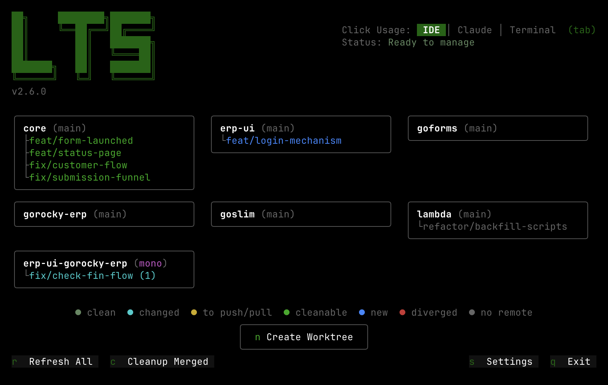
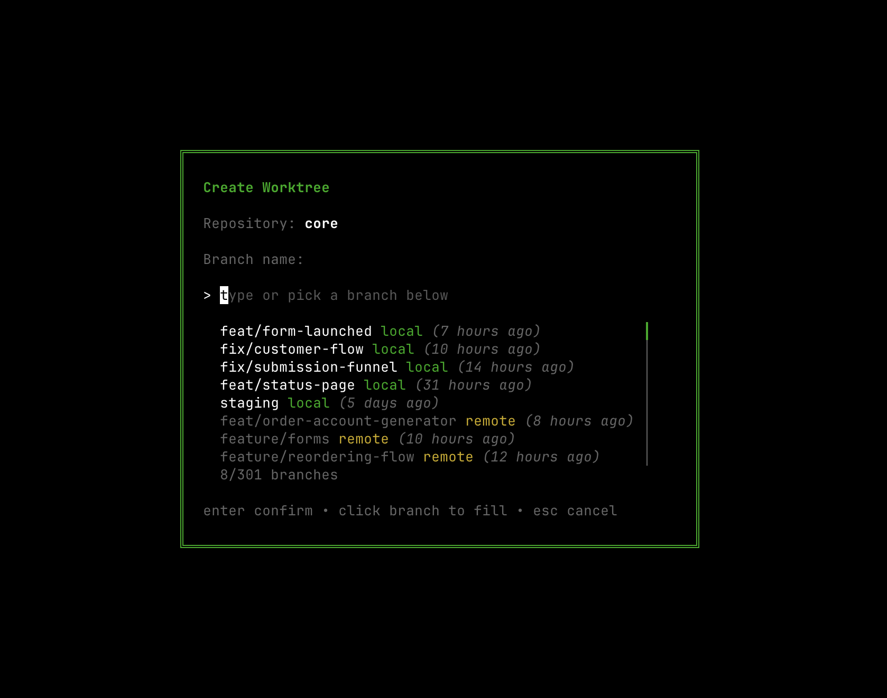
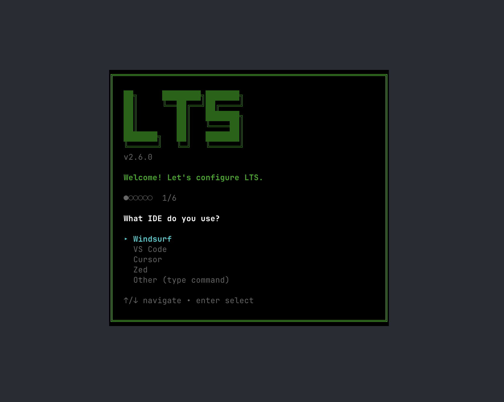

# LTS — Led's Tree Script

A modern terminal UI for managing git worktrees. Built with Go, Bubble Tea, and Lip Gloss.


```
██╗     ████████╗███████╗
██║     ╚══██╔══╝██╔════╝
██║        ██║   ███████╗
██║        ██║   ╚════██║
███████╗   ██║   ███████║
╚══════╝   ╚═╝   ╚══════╝
```

## Screenshots

<table>
  <tr>
    <td></td>
    <td></td>
    <td></td>
  </tr>
  <tr>
    <td align="center"><sub>Main View</sub></td>
    <td align="center"><sub>Create Worktree</sub></td>
    <td align="center"><sub>Setup Wizard</sub></td>
  </tr>
</table>

## Features

- **One-click worktree creation** — Stash, pull, branch, copy `.env`, install deps, and generate workspace in one step
- **Multi-repo worktrees** — Create worktrees across multiple repos at once for monorepo-like workflows
- **Click to open** — Open any worktree directly in your IDE, AI CLI, or terminal
- **Branch status at a glance** — Color-coded cards show clean, changed, diverged, merged, and new branches
- **Rebase, rename, delete** — Manage worktrees and branches from context menus without leaving the TUI
- **Setup wizard** — Walks you through configuration on first run; tweak anytime in Settings

## Platform Support

| OS | Architecture | Pre-built Binary | Notes |
|----|-------------|-----------------|-------|
| macOS | Apple Silicon (arm64) | Yes | Full support — iTerm2, Terminal.app via AppleScript |
| macOS | Intel (amd64) | Yes | Full support |
| Linux | x86-64 (amd64) | Yes | Uses `x-terminal-emulator` as default terminal fallback |
| Linux | ARM64 (arm64) | Yes | Same as Linux x86-64 |
| Windows | — | No | Use [WSL](https://learn.microsoft.com/en-us/windows/wsl/) |

Cross-platform terminals with native flag support: Ghostty, WezTerm, Alacritty, Kitty.
macOS-specific terminals: iTerm2, Terminal.app (via AppleScript).

## Installation

Requires Git.

```bash
curl -fsSL https://raw.githubusercontent.com/led-slzr/lts/main/install.sh | bash
```

The installer downloads a pre-built binary for your platform. If no pre-built binary is available, it falls back to building from source (requires [Go 1.21+](https://go.dev/dl/)).

<details>
<summary>Manual build from source</summary>

```bash
git clone https://github.com/led-slzr/lts.git
cd lts
go build -o lts .
mv lts ~/.local/bin/
```

</details>

## Uninstall

```bash
rm -f ~/.local/bin/lts          # Remove binary
rm -rf ~/.config/lts            # Remove global config
```

To also remove per-project config, delete `.lts.conf` from each project directory where LTS was used.

## Usage

```bash
lts                    # Run in current directory
lts --dir ~/projects   # Run in specific directory
lts --version          # Print version
```

On first run, LTS will launch a setup wizard to configure your preferences. You can change these anytime via the Settings UI (`s`).

## Keyboard Shortcuts

| Key | Action |
|-----|--------|
| `Tab` | Cycle click usage: IDE → AI CLI → Terminal |
| `n` | Create new worktree |
| `r` | Refresh all repos |
| `c` | Cleanup merged worktrees |
| `l` | Clear log panel |
| `s` | Open settings |
| `q` / `Ctrl+C` | Quit |
| `Esc` | Close modal / clear selection |

## Mouse

| Action | Result |
|--------|--------|
| Hover card | Border highlights white |
| Hover worktree | Row highlights, `[▸]` button appears |
| Click `[▸]` | Context menu (Rebase / Rename / Delete) |
| Click worktree | Opens in active click usage mode |
| Click footer buttons | Refresh All, Cleanup Merged, Settings, Exit |
| Scroll wheel (main area) | Scroll through repo grid |
| Scroll wheel (log area) | Scroll through log history |
| Scroll wheel (settings) | Scroll through settings list |

## Config

**Global** (`~/.config/lts/config`) — applies everywhere:

```
IDE_COMMAND="windsurf"
AI_CLI_COMMAND="claude"
PACKAGE_MANAGER="pnpm"
AUTO_REFRESH="24H"
TERMINAL="terminal"
DAILY_CHECK_FOR_UPDATES="true"
AUTO_UPDATE_NEW_RELEASE="true"
```

Supported values:
- **IDE**: `windsurf`, `code`, `cursor`, `zed` (or any custom command)
- **AI CLI**: `claude`, `opencode` (or any custom command, empty to disable)
- **Package Manager**: `pnpm`, `npm`, `yarn`, `bun`
- **Auto Refresh**: `15M`, `30M`, `1H`, `6H`, `12H`, `24H`
- **Terminal**: `ghostty`, `iterm`, `terminal`, `wezterm`, `alacritty`, `kitty` (or any custom command)
- **Check for Updates**: `true` / `false` — daily check for new releases on startup
- **Auto Update**: `true` / `false` — silently download and install new releases in the background

**Local** (`.lts.conf` in your project directory) — per-repo:

```
CORE_BASIS_BRANCH="main"
CORE_LAST_REFRESH="1711612800"
ERP_BASIS_BRANCH="dev"
ERP_LAST_REFRESH="1711612800"
```

Both configs are editable from the Settings UI inside LTS. Changes save immediately and reflect in the running app.

## License

MIT
