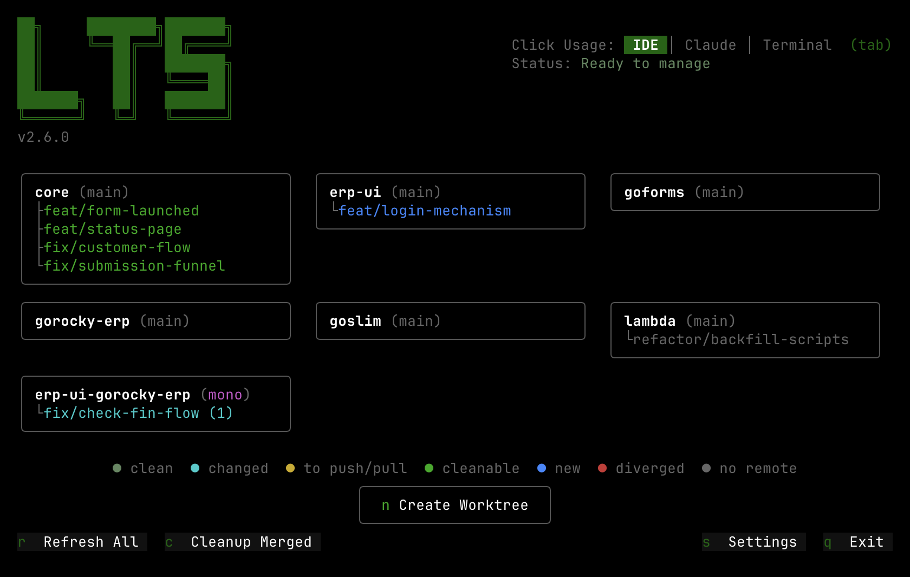
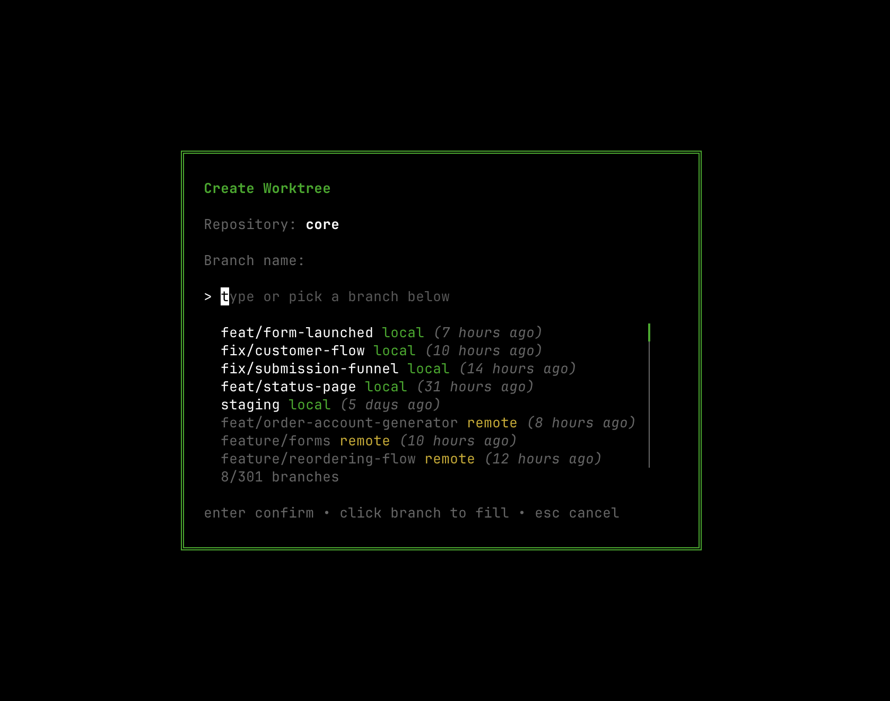
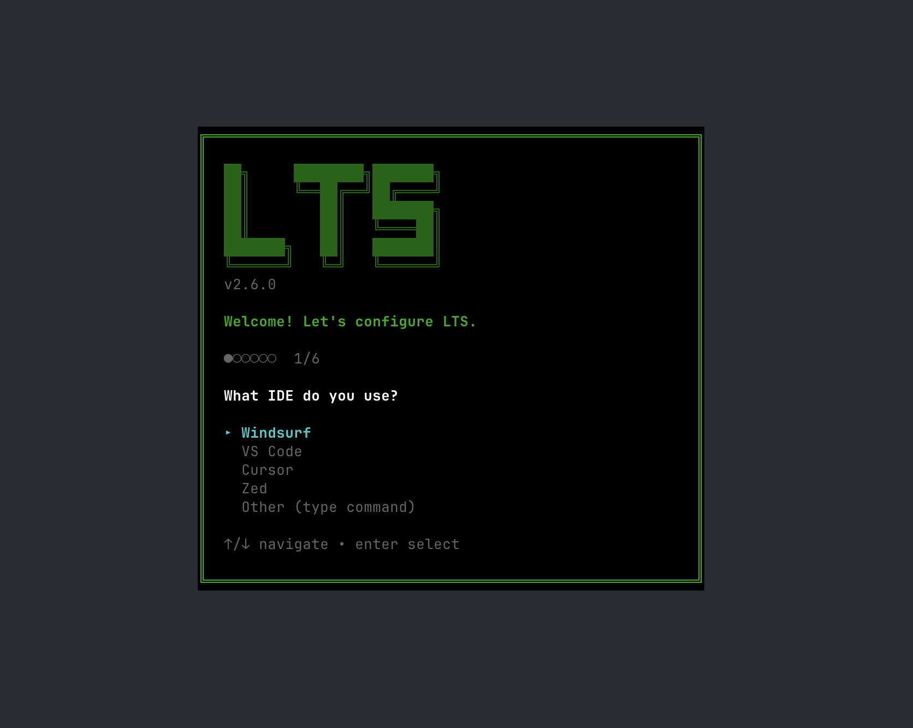

# LTS — Led's Tree Script

A modern terminal UI for managing git worktrees. Built with Go, Bubble Tea, and Lip Gloss.


```
██╗     ████████╗███████╗
██║     ╚══██╔══╝██╔════╝
██║        ██║   ███████╗
██║        ██║   ╚════██║
███████╗   ██║   ███████║
╚══════╝   ╚═╝   ╚══════╝
```

## Screenshots

<table>
  <tr>
    <td></td>
    <td></td>
    <td></td>
  </tr>
  <tr>
    <td align="center"><sub>Main View</sub></td>
    <td align="center"><sub>Create Worktree</sub></td>
    <td align="center"><sub>Setup Wizard</sub></td>
  </tr>
</table>

## Features

- **One-click worktree creation** — Stash, pull, branch, copy `.env`/`.mcp.json`, install deps, and generate workspace in one step (per-repo install toggles included)
- **Multi-repo worktrees** — Create worktrees across multiple repos at once for monorepo-like workflows, each repo using its own basis branch and package manager
- **Click to open** — Open any worktree directly in your IDE, AI CLI, or terminal
- **Tmux sessions per worktree** — With the tmux multiplexer enabled, AI CLI and Terminal opens share one persistent session per worktree (AI pane + shells, configurable layout); reopening reattaches, so AI conversations survive closing the terminal
- **Clone from GitHub** — With the [GitHub CLI](https://cli.github.com) installed and authenticated, press `c` (or click the "+ Clone a Repo" tile) to browse and clone any repo you can access, sorted by recency
- **Branch status at a glance** — Color-coded cards show clean, changed, diverged, merged, and new branches, plus tmux-session and busy indicators
- **Rebase, rename, delete, clean modules, kill sessions** — Manage worktrees from context menus (Board) or the action strip (Explorer) without leaving the TUI
- **Two layouts** — Board (repo cards) or Explorer (repo sidebar + worktree table with full status text, age, and tmux columns); switch with `shift+tab`
- **Per-repo concurrency** — Operations lock only the repos they touch; rebase one repo while another creates, with live logs for everything
- **Auto-maintenance** — Optionally clean `node_modules` and kill idle tmux sessions by age, on startup and hourly
- **Storage awareness** — A disk gauge in the header (green/yellow/red by fullness) and an Explorer SIZE column showing each worktree as `code+node_modules` (e.g. `300M+1.1G`), scanned in the background
- **Setup wizard** — Walks you through configuration on first run; tweak anytime in Settings (Preferences / Workspace / Worktrees / Diagnostics)

## Platform Support

| OS | Architecture | Pre-built Binary | Notes |
|----|-------------|-----------------|-------|
| macOS | Apple Silicon (arm64) | Yes | Full support — iTerm2, Terminal.app via AppleScript |
| macOS | Intel (amd64) | Yes | Full support |
| Linux | x86-64 (amd64) | Yes | Uses `x-terminal-emulator` as default terminal fallback |
| Linux | ARM64 (arm64) | Yes | Same as Linux x86-64 |
| Windows | — | No | Use [WSL](https://learn.microsoft.com/en-us/windows/wsl/) |

Cross-platform terminals with native flag support: Ghostty, WezTerm, Alacritty, Kitty.
macOS-specific terminals: iTerm2, Terminal.app (via AppleScript).

## Installation

Requires Git.

```bash
curl -fsSL https://raw.githubusercontent.com/led-slzr/lts/main/install.sh | bash
```

The installer downloads a pre-built binary for your platform. If no pre-built binary is available, it falls back to building from source (requires [Go 1.21+](https://go.dev/dl/)).

<details>
<summary>Manual build from source</summary>

```bash
git clone https://github.com/led-slzr/lts.git
cd lts
go build -o ~/.local/bin/lts .
```

</details>

## Uninstall

```bash
rm -f ~/.local/bin/lts          # Remove binary
rm -rf ~/.config/lts            # Remove global config
```

To also remove per-project config, delete `.lts.conf` from each project directory where LTS was used.

## Usage

```bash
lts                    # Run in current directory
lts --dir ~/projects   # Run in specific directory
lts --version          # Print version
```

On first run, LTS will launch a setup wizard to configure your preferences. You can change these anytime via the Settings UI (`s`).

## Keyboard Shortcuts

| Key | Action |
|-----|--------|
| `Tab` | Cycle click usage: IDE → AI CLI → Terminal |
| `Shift+Tab` | Switch layout: Board ↔ Explorer |
| `↑↓←→` / `hjkl` | Navigate (Explorer: sidebar/sheet; Board: scroll) |
| `Enter`, `b`, `m`, `p`, `d`, `x` | Explorer selected row: open, rebase, rename, purge modules, delete, kill tmux session |
| `n` | Create new worktree (Explorer: pre-seeded with the selected repo) |
| `c` | Clone a repo from GitHub (requires `gh`) |
| `r` | Refresh all repos |
| `Shift+C` | Cleanup merged worktrees |
| `l` | Clear log panel |
| `s` | Open settings |
| `q` / `Ctrl+C` | Quit |
| `Esc` | Close modal / clear selection / focus Explorer sidebar |

## Mouse

| Action | Result |
|--------|--------|
| Hover card | Border highlights white |
| Hover worktree | Row highlights, `[▸]` button appears |
| Click `[▸]` | Context menu (Rebase / Rename / Delete) |
| Click worktree | Opens in active click usage mode |
| Click footer buttons | Refresh All, Cleanup Merged, Settings, Exit |
| Click "+ Clone a Repo" | Opens the GitHub clone browser (Board tile / Explorer sidebar entry) |
| Explorer: hover row | Selects it and reveals the action strip |
| Scroll wheel (main area) | Scroll through repo grid |
| Scroll wheel (log area) | Scroll through log history |
| Scroll wheel (settings) | Scroll through settings list |

## Config

**Global** (`~/.config/lts/config`) — applies everywhere:

```
IDE_COMMAND="windsurf"
AI_CLI_COMMAND="claude"
PACKAGE_MANAGER="pnpm"
AUTO_REFRESH="24H"
TERMINAL="terminal"
TERMINAL_MULTIPLEXER="none"
TMUX_AI_PANE_WIDTH="50"
TMUX_RIGHT_PANES="1"
LAYOUT="board"
SORT_ORDER="activity"
DONE_SOUND="off"
AUTO_CLEAN_MODULES="OFF"
AUTO_KILL_TMUX="OFF"
DAILY_CHECK_FOR_UPDATES="true"
AUTO_UPDATE_NEW_RELEASE="true"
OPEN_ENV_IDE="true"
NEW_WT_PACKAGE_INSTALL="true"
COPY_ENV_FILES="true"
COPY_MCP_JSON="false"
```

Supported values:
- **IDE**: `windsurf`, `code`, `cursor`, `zed` (or any custom command)
- **AI CLI**: `claude`, `opencode` (or any custom command, empty to disable)
- **Package Manager**: `pnpm`, `npm`, `yarn`, `bun`
- **Auto Refresh**: `15M`, `30M`, `1H`, `6H`, `12H`, `24H`
- **Terminal**: `ghostty`, `iterm`, `terminal`, `wezterm`, `alacritty`, `kitty` (or any custom command)
- **Layout** (`LAYOUT`): `board` (default) or `explorer` — also toggled in-app with `shift+tab` or by clicking the Layout switcher in the header
- **Multiplexer**: `none`, `tmux` — with `tmux` (requires [tmux](https://github.com/tmux/tmux) installed), AI CLI and Terminal clicks share one tmux session per worktree (left pane: AI CLI, right pane: shell). Reopening a worktree reattaches to the same session, so your AI CLI conversation survives closing the terminal. Sessions are killed/renamed when the worktree is deleted/renamed.
- **Tmux AI Pane Width** (`TMUX_AI_PANE_WIDTH`): AI pane width as a percent of the window, `20`–`90` (default `50`).
- **Tmux Right Panes** (`TMUX_RIGHT_PANES`): `1`, `2`, or `3` evenly stacked shell panes in the right column (default `1`). Tmux layout changes apply the next time a worktree is opened — existing sessions are resized (and missing right panes added) without touching running processes; panes are never removed automatically.
- **Sort Repos & Worktrees** (`SORT_ORDER`): `activity` (default — most recently touched first), `created` (newest first), `name` (alphabetical); applies to Board cards, the Explorer sidebar, and worktree lists
- **Completion Sound** (`DONE_SOUND`): `off` (default), `glass`, `submarine`, `ping`, `pop`, `hero` (macOS system sounds; Linux plays the freedesktop completion sound), or `bell` (terminal bell, works everywhere) — plays when a worktree finishes creating; changing the setting previews it
- **Auto Clean Modules By Age** (`AUTO_CLEAN_MODULES`): `OFF` (default), `1D`, `3D`, `7D`, `14D`, `30D` — on startup, remove `node_modules` from worktrees idle longer than the threshold (by last git activity; worktrees with an attached tmux session are skipped)
- **Auto Kill Tmux By Age** (`AUTO_KILL_TMUX`): `OFF` (default), `8H`, `1D`, `3D`, `7D` — on startup, kill unattached LTS tmux sessions idle longer than the threshold (by tmux's own activity clock; attached sessions are never killed)
- **Check for Updates**: `true` / `false` — daily check for new releases on startup
- **Auto Update**: `true` / `false` — silently download and install new releases in the background

**Local** (`.lts.conf` in your project directory) — per-repo:

```
CORE_BASIS_BRANCH="main"
CORE_LAST_REFRESH="1711612800"
ERP_BASIS_BRANCH="dev"
ERP_LAST_REFRESH="1711612800"
```

Both configs are editable from the Settings UI inside LTS. Changes save immediately and reflect in the running app.

## GitHub Integration (optional)

LTS integrates with GitHub through the [GitHub CLI](https://cli.github.com) — install `gh` and run `gh auth login`, and the "+ Clone a Repo" tile (Board) / sidebar entry (Explorer) and the `c` key open a browser of every repo you can access, sorted by recent activity and filterable as you type. Without `gh`, the tile shows what's missing and everything else works normally; the Diagnostics tab reports install/auth state. Auth lives entirely in `gh` — LTS never stores credentials.

## License

MIT
